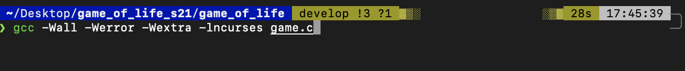
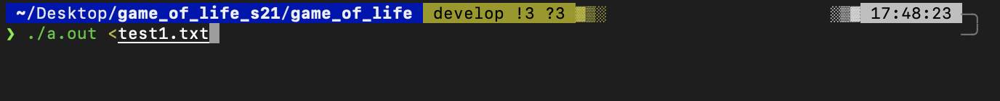
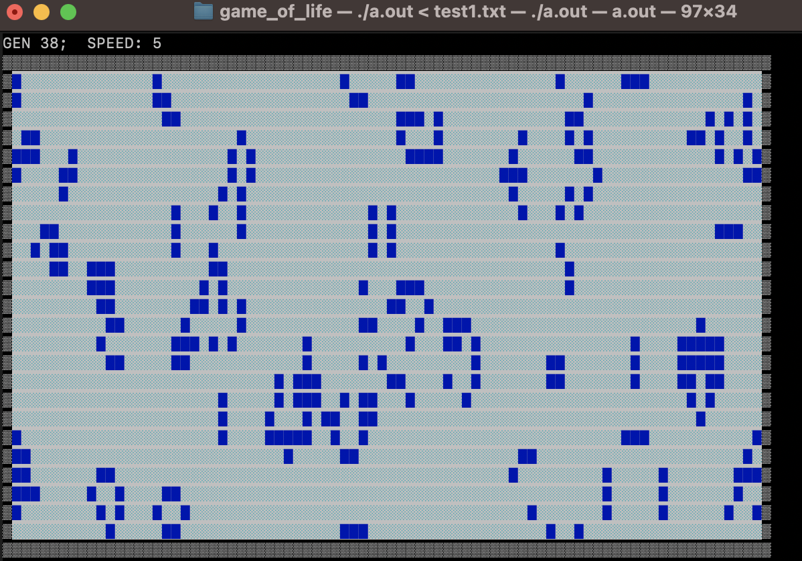

# gameoflifes21
We made game of life in real time with possibility make game faster or slower

To start the game ypu need to whrite in your terminal:
    ```bash
    gcc -Wall -Wextra -Werror -lncurses <name_of_test.txt
    ```

Then we need to run ./a.out with one of the test file
    ./a.out <ur_test_name.txt


This game was made in white and blue colors and loogs pretty good for terminal



If you want to make it faster, tap the buttom 'z' and 'a' to make it slower. To go out tap 'q'.
